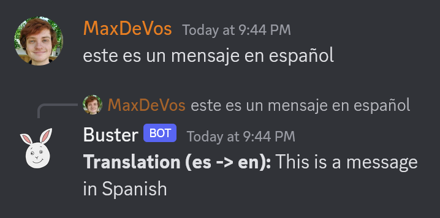

<em>Single-Guild minimal, secure, fully portable Discord bot for managing protected, tight-knit communities.</em>

***
As the threat against marginalized communities continues to grow, the need for protected social spaces becomes stronger. Buster is the solution that I created for the people in my life, and perhaps it could be of use to you as well.

<h1>Features</h1>

<h3>Anonymous invite approval system</h3>

In order to protect the people within your community, Buster employs a unique join system which requires the anonymous approval (or abstention) of all members of the server, and provides the opportunity for anybody to anonomously veto any admission via a message sent externally (a DM to Buster).

  
  

<h3>Internal Database</h3>

Contains "database-to-channel" (a term you'll only hear once) middleware which allows for use of one TextChannel as an event-driven database, with each message representing a table. This has the benefit of allowing the bot's code to be entirely portable, all data ABOUT the server is stored IN the server. No CVS files or MySQL database to carry around. Server goes down? Fire it up on your laptop.

<h3>Independent Pin System</h3>

50 pinned posts isn't nearly enough for most situations. Buster provides a means of democratically saving posts onto a pin board. When some number of users (of your selection) use the 📌 emoji on a post, it will be copied into the #pins channel with a link to the original post

  
  

<h3>Translation Engine</h3>

Buster uses the Google Translate API to provide free translation to users with specified lanuage roles.

<h3>Emoji Registration System</h3>

Depending on the size of your guild and your preferences, Buster can either report any emoji changes made by users, or provide an interface for users to offer new emojis to be voted on by the rest of the server.

